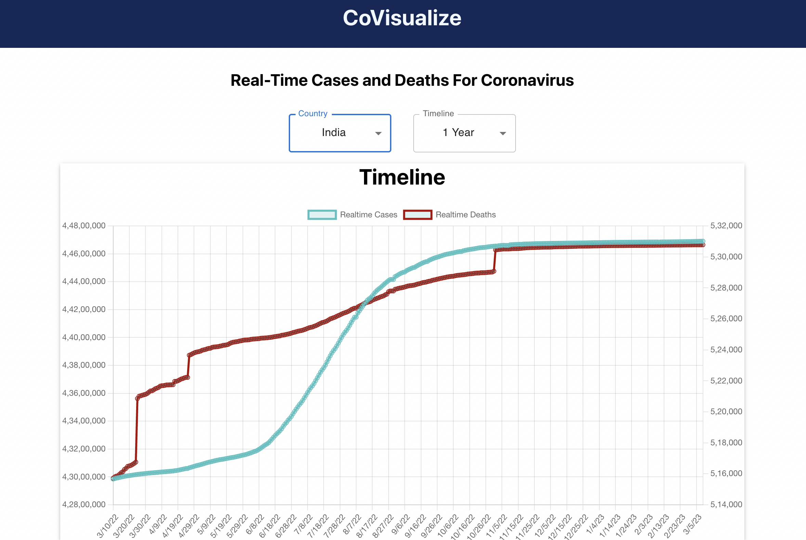
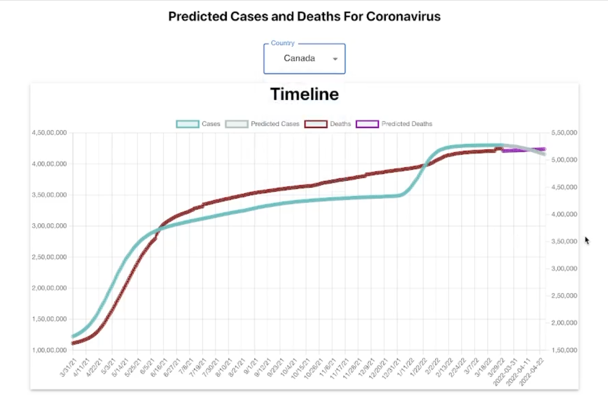

# Covisualize
A full-stack website to track real-time COVID-19 cases and deaths and predict them for the next one month using time-series analysis and SARIMAX model.

## [Working Demo](https://youtu.be/2m5glTGkpFU)
[](https://youtu.be/2m5glTGkpFU)

## Data Collection
The data for COVID-19 was obtained using [`disease.sh - Open Disease Data API`](https://disease.sh/)
For example-
```py
On hitting the endpoint- https://disease.sh/v3/covid-19/all

Response-
{
  "updated": 0,
  "cases": 0,
  "todayCases": 0,
  "deaths": 0,
  "recovered": 0,
  "todayRecovered": 0,
  "active": 0,
  "critical": 0,
  "casesPerOneMillion": 0,
  "deathsPerOneMillion": 0,
  "tests": 0,
  "testsPerOneMillion": 0,
  "population": 0,
  "oneCasePerPeople": 0,
  "oneDeathPerPeople": 0,
  "oneTestPerPeople": 0,
  "activePerOneMillion": 0,
  "recoveredPerOneMillion": 0,
  "criticalPerOneMillion": 0,
  "affectedCountries": 0
}
```

The `deaths` and `cases` are obtained from here for the past 1 year.

## Database and APIs
`DynamoDB` has been used as a NoSQL database for storage and retrieval of the data fetched from the `disease.sh API`.
Then `AWS Lambda` has been used for making API endpoint for the retrieval of predicted `cases` and `deaths` for visualization in the UI.

## Machine Learning
The `SARIMAX` time-series model is used for predicting the cases and deaths for the next one month given the past data. `AWS Sagemaker`'s Jupyter instance was used to train the model and store the `predicted cases` and `deaths` in the DynamoDB.



## Deployment
The whole application was packaged and deployed to the web using `Amazon S3`


